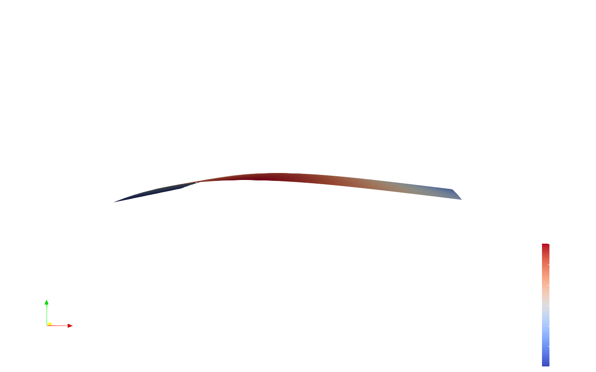
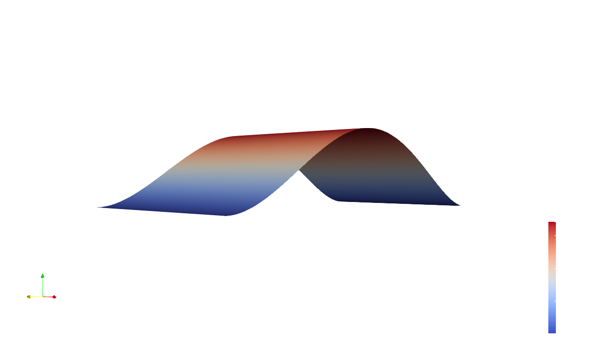

# Biharmonic-Solver
A Firedrake-based numerical solver for biharmonic partial differential equations

**Author:** Sanyang Liu

## Index
- [About the Project](#about-the-project)
- [Tutorial](#tutorial)
- [Reference](#reference)

## About the Project
This project focuses on developing numerical solver for the biharmonic partial differental equations with the governing equation:
``` math
\Delta^2 y = f
```
where $`\Delta`$ is the Laplace operator. The biharmonic equaiton is a fourth-order PDE which is used in the modeling of thin structrues the react elastically to external forces. Here, $`y`$ is the deformaiton on the plate and $`f`$ is the external force(s). Notice that the solution to the biharmonic equation is the minimizer of the following potential energy functional:
``` math
E[y] = \frac{1}{2}\int ||D^2y||_F^2 - \int f \cdot y
```
Hence we develop appropriate energy form and use the auto-derivative to construct the variational form. The project currently supports $`3`$ formulations:
- $`C^0`$ interior penalty method: use standard $`C^0`$ Lagrange elements for second order problems.
- Discontinuous Galerkin method: use discontiuous Lagrange elements.
- Mixed finite element method: add $`u = \nabla y`$ to form a system of second order PDEs and a saddle point system.

The configuration of method and other functionalities (e.g. mesh, function space, boundary conditions, ...) is powered by Hydra.

**Notice:** This project is currently under development and is NOT finished yet. Some features may be incomplete or subject to changes. Contributions and feedback are welcome!

## Tutorial
The repository has the following structure:
```bash
.
├── README.md                  # Documentation
├── requirements.txt           # Required packages
├── biharmonic-solver.py       # Main script
├── conf
│   └── config.yaml            # Configuration file
├── examples
│   ├── clamped-with-fixed-angle.yaml
│   └── compressive-buckling.yaml
├── outputs
│   └── figures
│       └── solution.png       # Visualization of the solution results
└── src
    ├── biharmonic.py          # Core implementation of the biharmonic solver
    └── utils.py               # Utility functions used across the project
```

### How to run the main solver?
To run the solver, followling these steps:
1. modify the file [config.yaml] in the directory [conf].
2. check [biharmonic-solver.py].
    (e.g. the path of [plot_deformation] within [run])
3. simply run the command:
```bash
python biharmonic-solver.py
```

### How to run the examples?
Check [biharmonic-solver.py]. Run:
```bash
python biharmonic-solver.py -cp examples -cn compressive-buckling
```
We currently support two examples:

clamped-with-fixed-angle:

compressive-buckling:


### How to configure the method?
We have 3 supported method:
- c0: C^0 interior penalty
- dg: discontinuous Galerkin method
- mix: mixed formulation using 'u = grad(y)'

If we want to run the compressive-buckling case with DG method, run:
```bash
python biharmonic-solver.py -cp examples -cn compressive-buckling method='dg'
```

### How to configure mesh and function space(s)?
We only have 2 supported mesh types: RectangleMesh, SquareMesh

For 'c0' and 'dg' method, we only have 1 function space which is configured as $`V`$. You might set the degree of $`Q`$ as **null** using Hydra's syntax.

### How to configure the expressions of functions?
Use list of str to specify expression of functions.

### How to configure the mixed boundary condtions?
For example, if we don't have the restriction with the gradient of deformaiton on the boundaries (i.e. the plate is simply supported), we could set boundary_condition.phi = **null**.
```bash
python biharmonic-solver.py -cp examples -cn compressive-buckling boundary_conditions.phi='null'
```

## Reference
- $`C^0`$ interior penalty method: Brenner, S.C., Sung, LY. C 0 Interior Penalty Methods for Fourth Order Elliptic Boundary Value Problems on Polygonal Domains. J Sci Comput 22, 83–118 (2005). https://doi.org/10.1007/s10915-004-4135-7

- Discontinuous Galerkin method: Bonito, A., Nochetto, R. H., & Ntogkas, D. (2020). DG Approach to Large Bending Plate Deformations with Isometry Constraint. arXiv preprint. Retrieved from https://arxiv.org/abs/1912.03812.